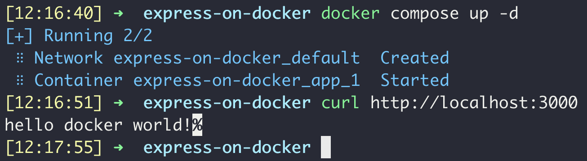
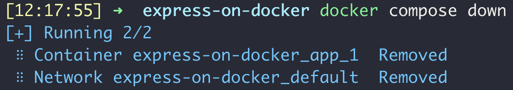

# 도커에 express 서버 올리기

</br>

# 목표

- docker 위에서 express 서버를 올리기
- `Dockerfile`없이 `docker-compose.yml` 파일만으로 컨테이너에 올리기

</br>

# 해야 할 것

- [x]  서버를 실행시킬 `app.js` 작성하기
- [x]  컨테이너를 만들 `docker-compose.yml` 작성하기
- [x]  (optional) `.dockerignore` 작성하기

</br>

# 코드 작성

"필요한 것은 필요할 때만 사용하는 것이다."

난 `Dockerfile`을 작성하는게 싫다. `docker-compose.yml`을 사용하면 되는 경우에 왜 굳이 `Dockerfile`을 써야하는지 아직 잘 모르겠다. 아마 이미지로 만들고싶을때 사용하는 것 같은데, 난 아직 그럴 필요가 없으므로 일단 `docker-compose.yml`만 써서 만들어보자. 

</br>

### 서버를 실행시킬 `app.js` 작성하기

컨테이너에서 잘 작동하는지만 확인할거니까, 간단히 http://localhost:3000에 접속하면 "hello docker world!"로 응답해주는 서버를 만들자. 

```java
/* library */
const express = require('express')
const logger = require('morgan')

/* app */
const app = express()
const port = 3000

/* middleware */
app.use(logger('dev'))

app.get('/', (req, res) => res.status(200).send('hello docker world!'))

/* listening */
app.listen(port, () => console.log(`server is listening at localhost:${port}`))
```

</br>

### 컨테이너를 만들 `docker-compose.yml` 작성하기

```docker
version: "3.9"
services:
  app:
    image: 
      node
    volumes:
      - ./:/app
    working_dir:
      /app
    command: 
      bash -c "npm install && node app.js"
    ports:
      - "3000:3000"
```

`version: "3.9"` : yml 파일 포맷 버전

`services: app` : 컨테이너에 올릴 서비스 이름. 아무렇게나 지어도 됨.

`image: node` : 컨테이너에 올릴 도커 이미지. 제대로 적기만 하면 dockerhub에서 알아서 다운받아진다.

`volumes: -./:/app` : 마운트하려는 {로컬 디렉토리}:{컨테이너 디렉토리}

`working_dir: /app` : 작업을 진행할 기본 디렉토리 설정

`command: bash -c "npm install && node app.js"` : 컨테이너가 실행될 때 실행할 명령어. 여기서는 node의 라이브러리를 설치하고, 서버를 실행시키는 명령어를 입력했다. 

`ports: - "3000:3000"` : "{호스트OS가 여는 포트}:{컨테이너가 여는 포트}". 

</br>

### (optional) `.dockerignore` 작성하기

```
**/node_modules
```

</br>

# **실행 확인**



이쁘구만



볼거 다 봤으니까 이제 집에 가라 (호에엥)

</br>

# 후기

- 만들고나면 쉬운데, 처음 만들기까지 너무 많은 시간이 걸렸다. 공학이란 오묘한 것이다.
- 인터넷에서 여기저기 많은 것들을 참고하면서 만들었는데, 너무 쓰잘데기없는 것들이 많이 들어가있었다. 그래서 <u>*정말 필요한 것들만 남기고*</u> 만드는 것이 정말 힘들었다.

</br>

# QA

